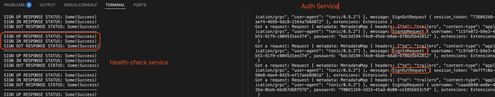

# Microservice Rust

A small Rust microservice demo using gRPC (tonic) that includes an auth service, a CLI client, and a health‑check service that exercises the auth APIs end‑to‑end.

## Project Scaffolding

```
├── Cargo.toml
├── README.md
├── build.rs
├── proto
│   └── authentication.proto
└── src
    ├── auth-service
    │   ├── auth.rs
    │   ├── main.rs
    │   ├── sessions.rs
    │   └── users.rs
    ├── client
    │   └── main.rs
    └── health-check-service
        └── main.rs
```

## What it does (high level)

- **auth-service**: gRPC server that handles sign up, sign in, and sign out.
- **client**: CLI tool that calls the auth service.
- **health-check-service**: looped gRPC client that continually verifies auth flows.

## File-by-file overview

### `proto/`
- **authentication.proto**  
  Defines the gRPC service, request/response messages, and status enum used across all services.

### `src/auth-service/`
- **main.rs**  
  Starts the gRPC server and wires in the auth implementation.
- **auth.rs**  
  Implements the gRPC service handlers (sign up, sign in, sign out) and orchestrates users/sessions.
- **users.rs**  
  User storage/lookup logic (e.g., create user, validate credentials, fetch UUID).
- **sessions.rs**  
  Session token creation and deletion logic.

### `src/client/`
- **main.rs**  
  CLI entry point (clap) that parses subcommands and calls the auth service over gRPC.

### `src/health-check-service/`
- **main.rs**  
  Loops through sign up → sign in → sign out with random credentials to validate the auth service.

## Demo

### Auth & Health Check Services
```bash
# Terminal 1: Start the auth service
cargo watch -c -q -w src/auth-service -x "run -q --bin auth-service"

# Terminal 2: Start the health check service
cargo watch -c -q -w src/health-check-service -x "run -q --bin health-check"
```



### Interacting with the Client
```bash
# Terminal 3: Use the CLI client to sign up, sign in, and sign out
cargo run --bin client -- sign-up --username alice --password secret
>>
SignUpResponse { status_code: Success }

cargo run --bin client -- sign-in --username alice --password secret
>>
SignInResponse { status_code: Success, user_uuid: "2efb8699-1bd8-427b-8d98-8e097445e3db", session_token: "11b35c08-a1b8-48fc-ab96-85fd1c899385" }

cargo run --bin client -- sign-out --session-token 11b35c08-a1b8-48fc-ab96-85fd1c899385
>>
SignOutResponse { status_code: Success }
```